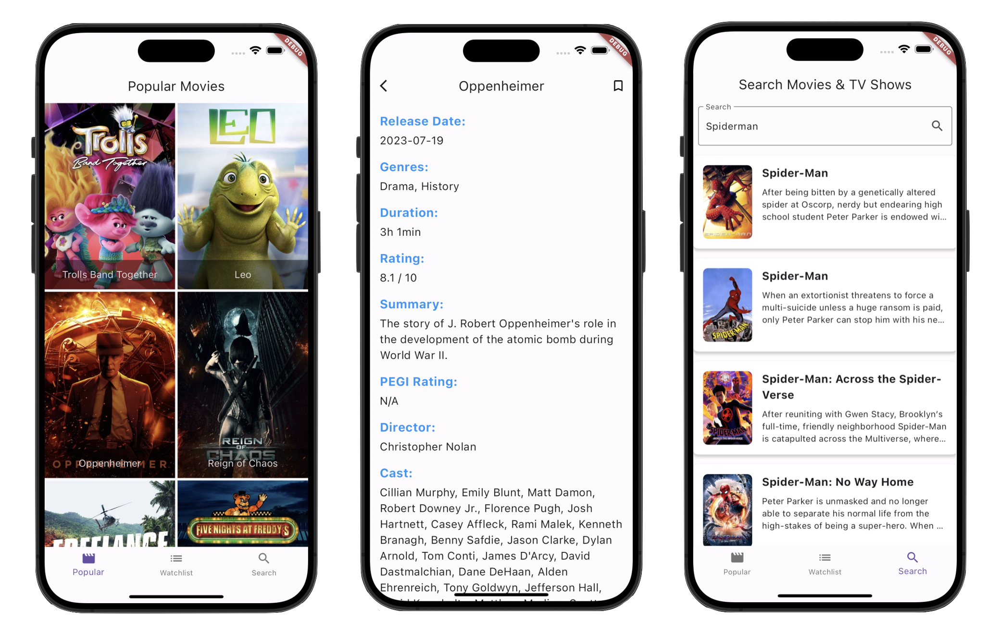

# Movie Data App

This is an application that sources movie data from The Movie Database (TMDB). My API keys are hardcoded into the code, so there is no need to generate or use your own.

## Prerequisites

Before downloading, make sure that you have Flutter and Dart installed on your development machine. You can install them by following the [official Flutter installation guide](https://flutter.dev/docs/get-started/install).

## Running the App

1. Clone this repository or download the project files to your local machine.

   ```bash
   git clone <repository-url>
   ```

2. Open the project files in the IDE of your choice.

3. Run the app, preferably on Xcode's iOS Simulator or an Android Emulator.

   ```bash
   export PATH="$PATH:`pwd`/flutter/bin"
   ```

   ```bash
   flutter run
   ```